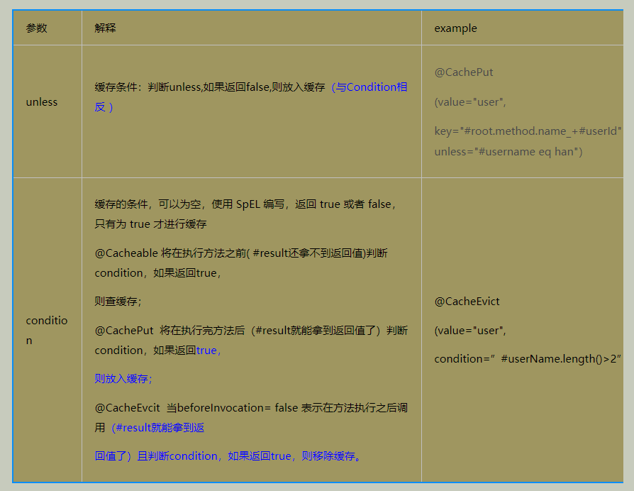
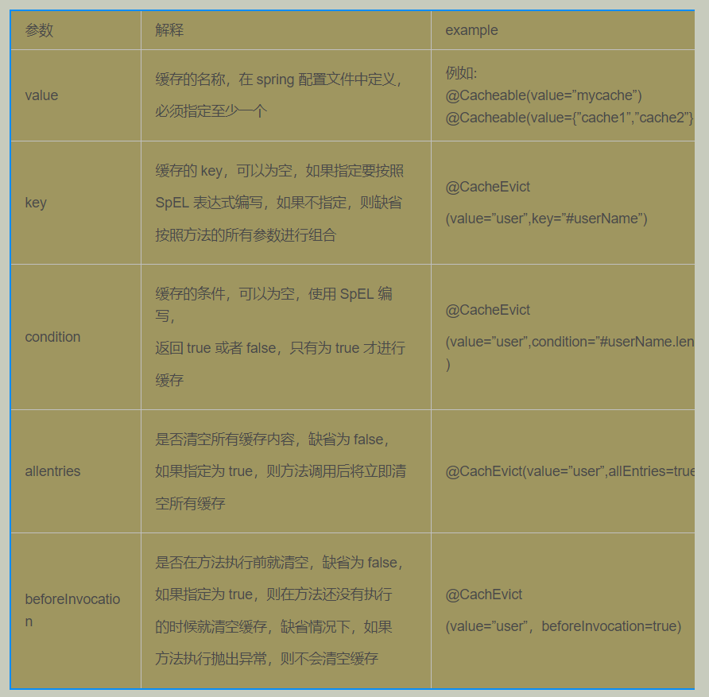

# springboot-redis-cache-annotation

Spring Boot集成Redis，通过使用注解的方式实现缓存

## 集成步骤

第一步：需要添加 spring-boot-starter-data-redis 依赖。

```groovy
implementation 'org.springframework.boot:spring-boot-starter-data-redis'
```

第二步：配置redis信息

```yaml
spring:
  redis:
    host: xxx.xxx.xxx.xxx
    port: 6379
    password: xxx
    database: 0
```

第三步：在启动类上添加注解，开启Redis缓存

```java
@EnableCaching
```

## 注解

保存时注解：

    @CachePut(value = "user", key = "#result.id", unless = "#result eq null")

查询时注解：

    @Cacheable(value = "user", key = "#userId", unless = "#result eq null")


为了保持整洁，可以使用自定义注解。如：

```java
@Caching(put = {
@CachePut(value = "user", key = "#user.id"),
@CachePut(value = "user", key = "#user.username"),
@CachePut(value = "user", key = "#user.email")
})
public User save(User user) {}
```

自定义注解如下：　

```java
@Caching(put = {
@CachePut(value = "user", key = "#user.id"),
@CachePut(value = "user", key = "#user.username"),
@CachePut(value = "user", key = "#user.email")
})
@Target({ElementType.METHOD, ElementType.TYPE})
@Retention(RetentionPolicy.RUNTIME)
@Inherited
public @interface UserSaveCache {
}
```

复制代码
将自定义注解添加到指定的方法上：这种方法会使代码很干净（强力推荐）

```java
@UserSaveCache
public User save(User user){}
```

## unless与condition

 

## @CacheEvcit



## 作者

- [个人网站](https://www.fengwenyi.com)

- [我的简书](https://www.jianshu.com/u/c1a1f1fefc78)

- [SegmentFault](https://segmentfault.com/u/fengwenyi)

- [CSDN](https://blog.csdn.net/qq_28336351)

- [开源中国-个人博客](https://my.oschina.net/fengwenyi)

- [慕课-手记](https://www.imooc.com/u/2815937)

- 邮箱：xfsy_2015@163.com

## Lisence

Lisenced under [Apache 2.0 lisence](https://opensource.org/licenses/Apache-2.0)